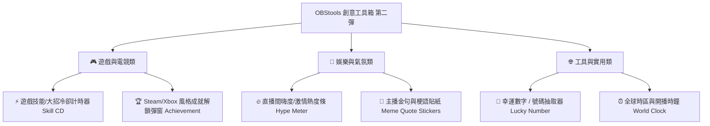

# 🎥 直播視覺工具箱 (OBStools) 最新工具提案書 (第二彈)
**OBStools Creative Streamer Tools Expansion Proposal (Vol. 2)**

---

## 📌 一、已完成工具與最新專案進度

**OBStools (直播工具箱)** 目前已上線 **9 款熱門直播工具**：
1. ⏱️ **直播倒數計時器 (`timer.js`)** - ✅ 已上線
2. 🎯 **追蹤 / 訂閱目標條 (`goal.js`)** - ✅ 已上線
3. 📢 **動態跑馬燈公告欄 (`marquee.js`)** - ✅ 已上線
4. 🎡 **直播抽獎 / 決策轉盤 (`wheel.js`)** - ✅ 已上線
5. 🔊 **快捷直播音效板 (`soundboard.js`)** - ✅ 已上線
6. ⏳/📢 **時間軸與跑馬燈二合一軌道 (`timeline.html`)** - ✅ 已上線
7. 📝 **主播即時備忘錄 / 待辦事項 (`checklist.html`)** - ✅ 已上線
8. 🏆 **勝負戰績與連勝計數器 (`streak.html`)** - ✅ 已上線 (需求 1)
9. ☕ **暫離 / 休息中預告卡 (`brb.html`)** - ✅ 已上線 (需求 4)
10. 📸 **視訊鏡頭霓虹相框 (`webcam.html`)** - ✅ 已上線 (需求 5)

---

## 🚀 二、全新發想之創意工具提案 (第二彈)

---

### 1. ⚡ 道具 A：遊戲技能與大招冷卻計時器 (Skill & Ultimate CD Tracker)
- **💡 概念**：針對 League of Legends、Valorant、Apex Legends、CS2 遊戲主設計。
- **🎯 實用亮點**：
  - 畫面即時顯示對手或自己召喚師技能/大招冷卻（例：`閃現 ⚡ 300s` `大招 💥 90s` `傳送 🌀 240s`）。
  - 熱鍵按 **`1`**、**`2`**、**`3`** 即刻啟動技能倒數，倒數完畢播放提醒聲！

---

### 2. 🏆 道具 B：Steam / Xbox 風格成就解鎖彈窗 (Achievement Unlocked Banner)
- **💡 概念**：在直播中解鎖特定成就時跳出的經典解鎖橫條與音效。
- **🎯 實用亮點**：
  - 例：`🏆 成就解鎖：首次單場 20 殺！` `🏆 成就解鎖：連續開播 100 天！`
  - 帶有經典 Steam / Xbox 獎盃登場動畫與解鎖提示聲，可自訂成就名稱與圖示。

---

### 3. 🔥 道具 C：直播間嗨度 / 激情熱度條 (Stream Hype Meter)
- **💡 概念**：量化直播間當前氣氛熱度量表 (0% ~ 100%)。
- **🎯 實用亮點**：
  - 當遊戲打出精彩好球或氣氛高漲時，主播按下 **`+`** 增加 Hype 熱度。
  - 當熱度達 100% 時，畫面瞬間觸發滿版彩帶與狂歡煙火動畫！

---

### 4. 💬 道具 D：主播金句與梗語貼紙 (Streamer Meme & Quote Stickers)
- **💡 概念**：主播專屬金句與經典梗語動態貼紙。
- **🎯 實用亮點**：
  - 控制台預設經典金句按鈕（例：`「這波不虧！」` `「全憑技術！」` `「我的我的！」`）。
  - 點擊按鈕或按快捷鍵，畫面上即刻彈出對應的霓虹梗語貼紙。

---

### 5. 🎲 道具 E：幸運數字 / 號碼抽取器 (Lucky Number Picker)
- **💡 概念**：快速抽取 1 ~ 100 (或自訂 1 ~ N) 號碼的幸運抽取器。
- **🎯 實用亮點**：
  - 適用於觀眾看台號碼抽獎、座位號抽取、觀眾遊戲順序決定。
  - 3D 滾動數字最終停在幸運號碼上。

---

### 6. ⏰ 道具 F：全球時區與開播時鐘 (Stream World Clock & Timezone)
- **💡 概念**：針對跨國 / 國際觀眾的實時多時區時鐘（如：`在地時間 21:00` `JST 22:00` `PST 06:00`）。
- **🎯 實用亮點**：
  - 自動計算各時區時間，方便海外觀眾對照開播時程。

---

## 🛠️ 三、提案推薦開發順序 (第二彈)

| 優先級 | 推薦工具名稱 | 推薦原因 |
| :--- | :--- | :--- |
| **🥇 第一優先** | ⚡ **遊戲技能大招冷卻計時器** | 英雄聯盟/Valorant 遊戲主播強烈需求，實用性極高 |
| **🥈 第二優先** | 🏆 **Steam/Xbox 風格成就解鎖彈窗** | 畫面娛樂效果極佳，能為直播帶來儀式感與慶祝氛圍 |
| **🥉 第三優先** | 🔥 **直播間嗨度 / 激情熱度條** | 帶動聊天室互動，滿熱度爆發煙火動畫極具張力 |
| **第四順位** | 💬 **主播金句梗語貼紙** / 🎲 **幸運號碼抽取器** | 增加直播台專屬梗與節目豐富度 |
