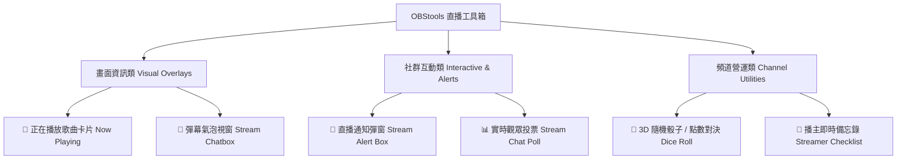

# 🎥 直播視覺工具箱 (OBStools) 新增工具擴充提案書
**OBStools Next-Gen Streamer Widgets Expansion Proposal**

---

## 📌 一、專案背景與擴充目標

**OBStools (直播工具箱)** 旨在提供直播主（Twitch / YouTube / OBS Studio 使用者）免費、高效能、免安裝、高顏值的視覺元件與互動工具。

目前系統已包含 **倒數計時器、目標進度條、跑馬燈與時間軸二合一軌道、抽獎轉盤、快捷音效板** 5 大核心工具。為進一步提升直播娛樂性、觀眾黏著度與頻道專業質感，本提案規劃新增 **6 款高需求、高互動性之工具模組**，並整合統一的 OBS 瀏覽器來源控制架構。

---

## 🚀 二、擬擴充之全新工具模組



### 1. 畫面資訊與視覺類 (Visual Overlays)

#### 🎵 工具 A1：正在播放歌曲卡片 (Stream BGM / Now Playing Card)
- **核心功能**：即時顯示直播背景音樂歌名、歌手、專輯封面與動態音波視覺化 (Audio Visualizer Bar)。
- **OBS 特色**：
  - 支援 Web Audio API 即時分析或模擬頻譜動態。
  - 提供精美霓虹唱片旋轉、玻璃擬態卡片等 3 種視覺主題。
  - 支援 OBS 自動淡入淡出動畫。

#### 💬 工具 A2：彈幕氣泡視窗 (Stream Chatbox Preview & Customizer)
- **核心功能**：自訂 Twitch / YouTube 直播彈幕的視覺樣式（氣泡框、圓角、字體大小、頭像外框）。
- **OBS 特色**：
  - 100% 透明背景，可設定彈幕停留時間、漸隱動畫。
  - 提供「電競動漫」、「簡約現代」、「賽博朋克」等多款 Preset 主題。

---

### 2. 社群互動與聲光類 (Interactive & Alerts)

#### 🎁 工具 B1：直播訂閱 / 贊助通知彈窗 (Stream Alert Box)
- **核心功能**：當有新追蹤、訂閱、抖內贊助時，觸發滿版/精美通知卡片與聲光效果。
- **OBS 特色**：
  - 內建 8 種合成特效音（歡呼、金幣、慶祝樂曲）。
  - 可於控制台手動測試彈窗發送（或串接 Webhook）。
  - 支援自訂感謝文字（例：`感謝 {user} 訂閱 3 個月！`）。

#### 📊 工具 B2：實時觀眾投票與問答卡 (Stream Chat Poll & Quiz)
- **核心功能**：主播可在直播中隨時發起 2 ~ 4 選項的即時投票（如：`今天吃什麼？` `下一場玩哪隻英雄？`）。
- **OBS 特色**：
  - 實時動態比例填滿條與百分比顯示。
  - 投票結束後自動播放勝利獲勝選項之閃爍動畫。

---

### 3. 互動遊戲與頻道營運類 (Interactive Games & Utilities)

#### 🎲 工具 C1：3D 隨機骰子 / 點數大對決 (3D Dice Roll & Randomizer)
- **核心功能**：適用於桌遊實況、懲罰遊戲、觀眾 PK 點數。
- **OBS 特色**：
  - HTML5 Canvas / CSS3 3D 物理滾動骰子動畫。
  - 按下快捷鍵 **`R`** 或控制台點擊即可即時擲骰子並顯示大字點數。

#### 📝 工具 C2：主播即時備忘錄與待辦事項 (Streamer Checklist)
- **核心功能**：協助主播在直播中紀錄關鍵事項（如：`乾爹工商講稿` `本局特定挑戰條件` `下播提醒`）。
- **OBS 特色**：
  - 可設定「僅主播可見（隱藏於 OBS 畫面上方）」或「公開顯示於直播畫面角落」。

---

## 🛠️ 三、技術架構與模組設計 (Technical Architecture)

```
OBStools Architecture
 ├── index.html               (主控台 Dashboard)
 ├── css/
 │    ├── styles.css          (主介面樣式)
 │    └── timeline.css        (時間軸/跑馬燈專屬樣式)
 ├── js/
 │    ├── app.js              (主應用與 Modal 管理器)
 │    ├── timeline.js         (時間軸與跑馬燈控制器)
 │    └── tools/              (模組化工具類)
 │         ├── timer.js
 │         ├── goal.js
 │         ├── marquee.js
 │         ├── wheel.js
 │         ├── soundboard.js
 │         ├── timeline.js
 │         ├── alertbox.js     [NEW] 規劃新增
 │         └── bgmcard.js      [NEW] 規劃新增
 └── server.py                (Python 本地伺服器)
```

1. **統一 Query Parameter 控制協定**：
   - 每個新增工具均支援 `?overlay={tool_name}&param1=val1...` 之 URL 結構，確保直接複製貼入 OBS 瀏覽器來源即可運作。
2. **跨視窗同步 (BroadcastChannel API)**：
   - 主控台與 OBS 瀏覽器來源視窗之間使用 `BroadcastChannel` 通訊，實現主播在主控台點擊按鈕，OBS 畫面 **0 延遲即時更新**。
3. **輕量零依賴**：
   - 延續 Vanilla HTML/CSS/JS ES Module 架構，載入速度小於 100ms，OBS 效能 CPU 佔用率 < 1%。

---

## 📅 四、開發階段與時程規劃 (Roadmap)

| 階段 | 預計開發項目 | 焦點目標 |
| :--- | :--- | :--- |
| **Phase 1 (近程)** | 🎁 直播通知彈窗 (Alert Box)<br>🎵 歌曲播放卡片 (Now Playing) | 補強直播基礎聲光視覺，提升開播氛圍 |
| **Phase 2 (中程)** | 📊 實時觀眾投票 (Chat Poll)<br>🎲 3D 隨機骰子 (Dice Roll) | 強化觀眾互動與直播娛樂性 |
| **Phase 3 (遠程)** | 💬 彈幕氣泡視覺自訂器<br>📝 主播即時備忘錄 (Checklist) | 完善直播主頻道營運與資訊管理需求 |

---

## 💡 五、預期效益

1. **豐富視覺表現**：打造媲美專業 streamer 團隊的電競級視覺與動畫。
2. **極致使用體驗**：繼續維持「一鍵複製網址、免安裝、100% 透明背景」的核心優勢。
3. **頻道互動率提升**：透過投票、骰子與通知彈窗，大幅增加直播間觀眾留言與互動頻率。
