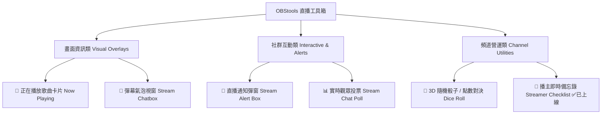

# 🎥 直播視覺工具箱 (OBStools) 新增工具擴充提案書 (全功能升級版)
**OBStools Next-Gen Streamer Widgets Expansion Proposal & Architectural Specification**

---

## 📌 一、專案背景與擴充目標

**OBStools (直播工具箱)** 旨在提供直播主（Twitch / YouTube / OBS Studio 使用者）免費、高效能、免安裝、高顏值的視覺元件與互動工具。

目前系統已成功上線 **6 大核心工具模組**：
1. ⏱️ **直播倒數計時器 (`timer.js`)**
2. 🎯 **追蹤 / 訂閱目標條 (`goal.js`)**
3. 📢 **動態跑馬燈公告欄 (`marquee.js`)**
4. 🎡 **直播抽獎 / 決策轉盤 (`wheel.js`)**
5. 🔊 **快捷直播音效板 (`soundboard.js`)**
6. ⏳/📢 **時間軸與跑馬燈二合一軌道 (`timeline.html`)**
7. 📝 **主播即時備忘錄 / 待辦事項 (`checklist.html`)** *(已於最新版本成功完成上線！)*

為進一步提升直播間聲光效果、觀眾參與度與頻道專業質感，本提案規劃下一階段 **4 款高需求工具模組** 之詳細設計規格與技術實現路徑。

---

## 🚀 二、新工具模組擴充規劃與詳細規格



---

### 1. 🎁 工具 1：直播訂閱 / 贊助通知彈窗 (Stream Alert Box)

#### 🎯 產品定位
直播間最核心的聲光獎勵機制，當觀眾追蹤、訂閱、抖內或贈送訂閱時，畫面上跳出精美動畫卡片與特效聲音。

#### 📐 UI 介面與動態佈局
```
+-------------------------------------------------------+
|  [🎉 感謝訂閱]                                         |
|  +--------+   GAMER_PRO99                              |
|  | AVATAR |   已連續訂閱 6 個月！                      |
|  +--------+   "這集實況太精彩了，加油！"               |
+-------------------------------------------------------+
```

#### ⚙️ 核心功能點
1. **多重觸發類別 (Alert Types)**：
   - 💜 新追蹤者 (New Follower)
   - ⭐️ 新訂閱 / 續訂 (Sub / Resub)
   - 💎 小費 / 抖內 (Donation / SuperChat)
   - 🎁 贈送訂閱 (Sub Gifts)
2. **音效與動畫系統**：
   - 內建 8 種 Web Audio API 歡呼與慶祝效果音（免載入外部 mp3）。
   - 提供 4 種登場動畫：`Fade In` / `Bounce In` / `Slide In` / `Neon Pulse`。
3. **控制台手動測試 (Test Alerts)**：
   - 在 OBS 控制台中點擊 `[測試訂閱彈窗]`，可即時在 OBS 畫面測試動畫與聲音。

---

### 2. 🎵 工具 2：正在播放歌曲卡片 (Now Playing Card)

#### 🎯 產品定位
適用於音樂台、繪圖台或遊戲雜談台，在畫面角落優雅呈現當前背景音樂 (BGM) 歌名與專輯視覺。

#### 📐 UI 介面與動態佈局
```
+-------------------------------------------------------+
|  +-------+  🎵 Cyberpunk Synthwave - Lofi Beat        |
|  | ALBUM |  Artist: Neon Dreamer                      |
|  | ART   |  [||| | | |||| | ||| | ||| ] 頻譜音波條   |
|  +-------+                                            |
+-------------------------------------------------------+
```

#### ⚙️ 核心功能點
1. **頻譜音波視覺化 (Audio Visualizer)**：
   - 即時運算 Web Audio 分析器 (AnalyserNode)，隨著音樂節奏起伏跳動。
2. **多款主題風格 (Presets)**：
   - 唱片旋轉風格 (Vinyl Player)
   - 霓虹玻璃卡片 (Glassmorphism Pill)
   - 簡約極簡滾動條 (Minimalist Bar)
3. **URL 參數直接指定歌名與歌手**：
   - 支援 `?song=Lofi+Beat&artist=Chill+Hop` 即時更換，或於控制台動態輸入。

---

### 3. 📊 工具 3：實時觀眾投票與問答卡 (Stream Chat Poll)

#### 🎯 產品定位
高互動率神器，主播可在直播中隨時發起 2 ~ 4 選項的隨堂投票（例如：`下一步要選哪個英雄？` `今天吃火鍋還是燒肉？`）。

#### 📐 UI 介面與動態佈局
```
+-------------------------------------------------------+
|  📊 投票：今天晚餐吃什麼？                             |
|  [A] 火鍋      ████████████████████ 65% (130票)       |
|  [B] 燒肉      █████████ 35% (70票)                     |
+-------------------------------------------------------+
```

#### ⚙️ 核心功能點
1. **動態填滿進度條**：
   - 票數改變時進度條帶有光滑平移 (`transition: width 0.4s ease-out`)。
2. **獲勝者高亮效果 (Victory Highlight)**：
   - 主播按下 `[結算投票]` 時，最高票選項會跳出金黃色邊框閃爍動畫。
3. **控制台加減票數**：
   - 支援主播手動點擊加票，或透過熱鍵快切。

---

### 4. 🎲 工具 4：3D 隨機骰子 / 點數大對決 (3D Dice Roll & Randomizer)

#### 🎯 產品定位
適用於 TRPG 桌遊實況、觀眾點數大對決、懲罰遊戲數值抽選。

#### 📐 UI 介面與動態佈局
```
+-------------------------------------------------------+
|                       ┌───┐                           |
|                       │ 6 │  🎲 擲出點數： 6 點！     |
|                       └───┘                           |
+-------------------------------------------------------+
```

#### ⚙️ 核心功能點
1. **3D 滾動物理動畫**：
   - 使用 CSS3 3D Transform (`rotateX`, `rotateY`) 呈現真實滾動減速效果。
2. **快捷鍵一鍵擲骰**：
   - 在 OBS 互動模式下按下 **`R`** 鍵或 **`Spacebar`** 即刻擲骰。
3. **支援多顆骰子 (1d6 ~ 3d6)**：
   - 可設定 1 ~ 3 顆骰子同時滾動並自動加總總點數。

---

## 🛠️ 三、技術架構與擴充設計 (Technical Architecture)

### 1. 專案目錄架構
```
OBStools Architecture
 ├── index.html               (主控台 Dashboard)
 ├── timeline.html            (時間軸與跑馬燈 Overlay)
 ├── checklist.html           (主播備忘錄 Overlay - 已上線)
 ├── alertbox.html            (直播通知彈窗 Overlay - NEW)
 ├── bgmcard.html             (歌曲卡片 Overlay - NEW)
 ├── css/
 │    ├── styles.css          (主介面樣式)
 │    ├── timeline.css        (時間軸/跑馬燈專屬樣式)
 │    └── checklist.css       (備忘錄專屬樣式)
 ├── js/
 │    ├── app.js              (主應用與 Modal 管理器)
 │    ├── timeline.js         (時間軸與跑馬燈控制器)
 │    ├── checklist.js        (備忘錄控制器)
 │    └── tools/              (模組化工具類)
 │         ├── timer.js
 │         ├── goal.js
 │         ├── marquee.js
 │         ├── wheel.js
 │         ├── soundboard.js
 │         ├── timeline.js
 │         ├── checklist.js
 │         ├── alertbox.js     [NEW]
 │         └── bgmcard.js      [NEW]
 └── server.py                (Python 本地伺服器)
```

### 2. 跨視窗狀態同步 (BroadcastChannel Protocol)
主控台與 OBS 瀏覽器來源視窗採用原生 `BroadcastChannel` 傳輸，確保免伺服器即時同步：

```javascript
// 主控台廣播事件 (Dashboard -> OBS Overlay)
const channel = new BroadcastChannel('obstools_channel');
channel.postMessage({ type: 'ALERT_TRIGGER', category: 'sub', user: 'GAMER_PRO99' });

// OBS Overlay 接收事件 (OBS Overlay)
channel.onmessage = (event) => {
  if (event.data.type === 'ALERT_TRIGGER') {
    showAlert(event.data);
  }
};
```

---

## 📅 四、開發階段與時程規劃 (Roadmap)

| 階段 | 開發項目 | 完成狀態 / 目標 |
| :--- | :--- | :--- |
| **Phase 1** | ⏱️ 計時器 / 🎯 目標條 / 📢 跑馬燈 / 🎡 轉盤 / 🔊 音效板 | ✅ **100% 已上線** |
| **Phase 2** | ⏳/📢 時間軸跑馬燈二合一 / 📝 主播備忘錄 | ✅ **100% 已上線** |
| **Phase 3** | 🎁 直播通知彈窗 (Alert Box) / 🎵 歌曲播放卡片 | 🚀 下一階段預計完成 |
| **Phase 4** | 📊 實時觀眾投票 (Chat Poll) / 🎲 3D 隨機骰子 | 💡 後續擴充規劃 |

---

## 💡 五、總結效益

1. **模組化無限擴充**：獨立 `.html` + `.css` + `.js` 架構，維持維護靈活性與極佳效能。
2. **零延遲與零依賴**：完全基於現代 Web 標準與 Web Audio API，無需外掛第三方重量級框架。
3. **OBS 友善**：全工具支援 `?hidebtn=true` 與透明背景，複製網址即可完美融入直播畫面！
